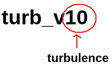
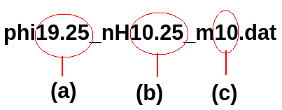

# Fe II template
## New theoretical Fe II template for fitting optical to UV (1000-10000 Angstrom) Quasar spectra

This new Fe II template is developed using the latest Fe II atomic database of Smyth et al. (2019) within the CLOUDY C23.0 photoionization code with the following set of parameters.

### H-ionizing photons flux: 17 $\leq \log \Phi_{\rm H}\,(\rm cm^{-2} s^{-1}) \leq$ 22, and  
### Gas density: 9 $\leq \log n_{\rm H}\, (\rm cm^{-3}) \leq$ 14

### Hydroge column density: 10 $^{24}$ cm $^{-2}$  
### Abundance: solar

### The Fe II template is available for the microturbulence values 0,10, 20, 30, 50 and 100 km/s.

## There are six directories consisting of Fe II templates for these different microturbulence values. 
They are named as following. 

The files within each directory are named as follows:  

where (a) log value of the H-ionizing photon flux in $\rm cm^{-2} s^{-1}$,  
(b) log value of the Hydrogen gas density in $\rm cm^{-3}$, and  
(c) the value of microturbulence in km/s.  

## Each template file has two columns 
<b>First column:</b> wavelength in $\AA$ with 2 $\AA$ binning 
<b>Second column:</b> line intensity

